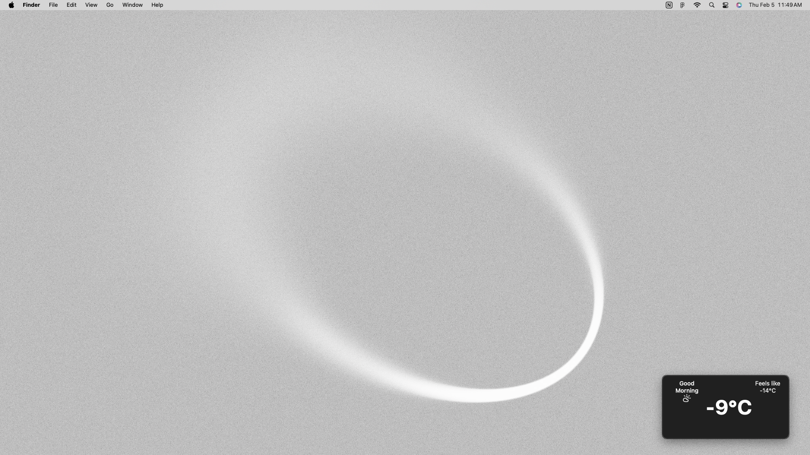

# Better Weather

A lightweight, frameless weather wdiget that displays current weather information in a compact, always on top window. The app automatically detects your location using your IP address and fetches real time weather data from the Open Meteo API.




---

## Features

- Automatic location detection via IP geolocation
- Current temperature and "feels like" temperature
- Dynamic weather icons based on conditions
- Clean, modern UI with dark theme
- Always on top frameless window
- Cached API requests for improved performance
- Time based greeting (Morning/Afternoon/Evening)

## Prerequisites

- Python 3.7 or higher
- IPInfo API token (free tier available at [ipinfo.io](https://ipinfo.io))

## Installation

1. Clone the repository:

```bash
git clone https://github.com/JonathanEveillard/Better-Weather
cd betterweather
```

2. Create a `.env` file in the project root:

```bash
IPINFO_TOKEN=your_ipinfo_token_here
```

3. Run the application:

```bash
python run.py
```

The `run.py` script will automatically:

- Create a virtual environment if one doesn't exist
- Install all required dependencies from `requirements.txt`
- Launch the weather application

### Manual Setup (Alternative)

If you prefer to set up manually:

```bash
# Create virtual environment
python -m venv venv

# Activate virtual environment
# Windows:
.\venv\Scripts\activate
# Linux/Mac:
source ./venv/bin/activate

# Install dependencies
pip install -r requirements.txt

# Run the application
python run.py
```

## Dependencies

- `openmeteo-requests` - Open-Meteo API client
- `pandas` - Data manipulation
- `requests-cache` - API request caching
- `retry-requests` - Request retry logic
- `ipinfo` - IP geolocation service
- `pywebview` - GUI framework
- `python-dotenv` - Environment variable management

## Configuration

The application uses the following environment variables (stored in `.env`):

- `IPINFO_TOKEN` - Your IPInfo API token (required)

## Weather Codes

The app displays different icons based on WMO Weather interpretation codes:

- Clear sky → Sun
- Partly cloudy → Cloud with sun
- Overcast → Cloud
- Fog → Cloud with fog
- Drizzle → Cloud with drizzle
- Rain → Cloud with rain
- Snow → Snowflake
- Thunderstorm → Cloud with lightning

## Usage

Once launched, the application displays a compact window showing:

- Time appropriate greeting
- Current weather icon
- Current temperature in Celsius
- "Feels like" temperature

The window is frameless and stays on top of other windows for easy visibility.

## Contributing

Contributions are welcome! Please feel free to submit a Pull Request.

## License

This project is open source and available under the MIT License.

## API Credits

- Weather data: [Open-Meteo](https://open-meteo.com/)
- Location detection: [IPInfo](https://ipinfo.io/)
- Icons: [Lucide Icons](https://lucide.dev/)
